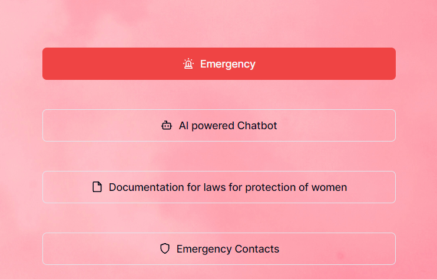

#### Superwomen is an webapp created to contribute to doing our bit in the cause for women safety. It has helpful features including custom data (based on indian women rights) ***Openai*** Chatbot and some emergency contacts 
AIM :- TO CREATE A USEFUL WEBAPP WHICH MAKES SENSE FOR A WEBSITE AND NOT COMPARE IT TO A MOBILE APP
NOTE :- THIS WAS BUILT IN LESS THAN 24 HRS DURING AN HACKATHON EVENT
## Features:-
1. ***Openai*** custom law bot
> The chatbot was create using supabase vector database and openai embeddings with openai search for answers using typescript node env 

2. ***Emergency Contacts*** 
> The emergency contacts are fetched from the database to SMS in times of need

 

3. ***Report an incident***
> The report an incident feature is used to report an incident and the data is stored in the database for alerting others about mishaps occuring in the area

4. **Documentation and emergency button**
> The documentation is regarding indian women right laws and emergency button is used to send the sms in times of need

## Tech Stack:-
1. React
1. Supabase/Pgsql(vector database)
1. Typescript
1. Nextjs
1. Openai(API)
1. Tailwindcss
